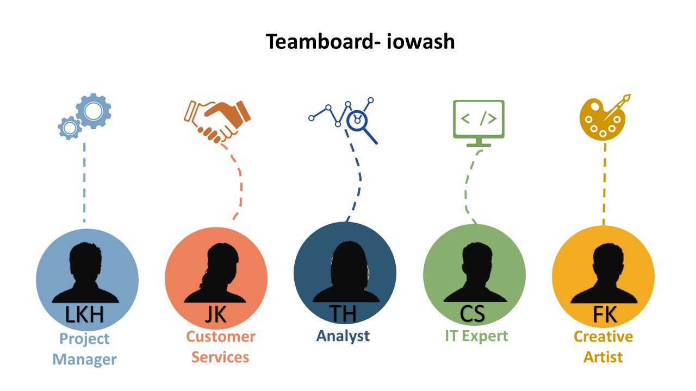

# 1. Co-Creation
## 1.1 Team Roles and Responsibilities

For a project to be successful, the project staff must work well together. For this it is necessary to optimally fill the project team.
Our team consists of 5 people, who are task-oriented and should work together.
In the first step, we defined which roles we need for the project. In the second step we decided which person in the team takes over which role.

The roles are as follows:

<b>Project Manager</b> 
operational organizational management of the project, implementation of project planning, project management, project controlling / status check, ensuring compliance with deadline and economic project goals

<b>Customer Services</b>  
Communication with the customer, definition of the requirements and contents of the project from the customer's point of view, carrying out tests and testing of all active systems and components, identifying the right channels for communication with customers (via web, social media, etc.)

<b>	Analyst</b> 
Identify state, describe existing problems / opportunities, define goals, create solution design / service design, create business case, analyze and optimize business processes

<b>IT Expert</b> 
examination of technical requirements, technical implementation of the project, creation of mockups, information on the status, on-time and cost-effective delivery of the results

<b>Creative Artist</b> 
development of marketing strategies, control of marketing activities (online and offline), campaign management, development of marketing concepts for existing or new products, production of product and image films

[:arrow_backward: ](../README.md)[:arrow_up_small: ](../README.md)[:arrow_forward: ](../01_Co-Creation/1.2_Methods.md)
