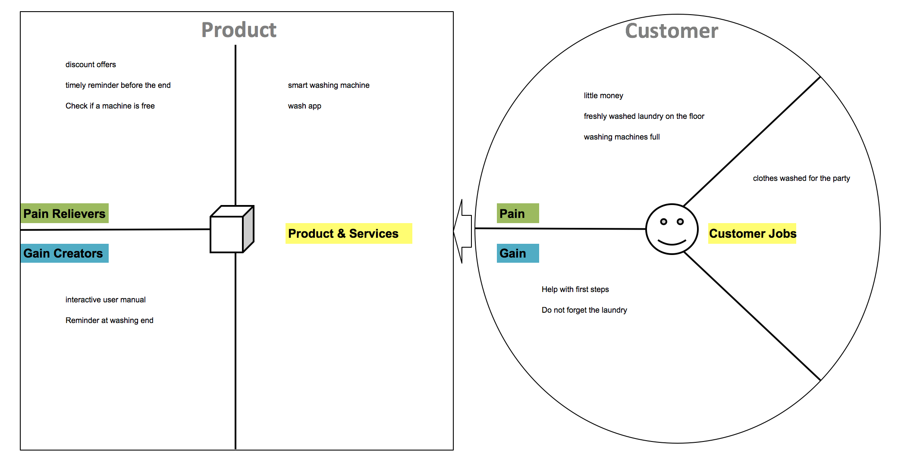

# 1. Co-Creation
## 1.2 Methods
### 1.2.1 Personas

In order to work out the goals and needs of our target group, we create potential users as personas. The goal is to develop a user-friendly product. Our personas are fictional users within our target group. Like real users, our personas have needs, abilities and goals. They do not represent the average of the crowd, but are specific people who make patterns in user behavior clear.

First, we thought about which personas are needed. the group of users of communal washing machines is easy to isolate on residential complexes and student hostels.
For each of these two types of housing, we each created a persona as well as another persona for the administration of the washing machines.

Our personas are <b>Rolf</b> (stressed system administrator with little time, live in a residential complex), <b>Anja</b> (student with first own apartment, lives in a student hostel) and <b>Herbert</b> (property manager and responsible for the administration of washing machines).
The following describes the personas as such. It also describes what the appropriate persona says, thinks, feels and does about our problem.

#### Rolf

#### Anja

#### Herbert

### 1.2.2 Value Proposition

#### Rolf

The stressed-out rolf works a lot during the week, as he has a great deal of responsibility in his job. Therefore, he only has to wash his laundry at the weekend. however, the washing machines are permanently occupied on the days. when he has finally found a free machine, the search starts for coins.  
In order to simplify the washing process, the product should offer an availability check in which the free machine can be pre-reserved. In addition, the possibility of cashless payment should be offered.

#### Anja

The student anja has lectures during the week in mannheim, but mostly confined to a few hours a day. every two weeks she travels home to berlin over the weekend. During the week she usually forgets to wash. And if she thinks about it on the weekend, the machines are mostly occupied. Unfortunately, she often forgets that she washes laundry. when she remembers, her freshly washed machine often lies on the floor and other laundry is in the machine. In addition, Anja usually has no money to wash as a student. 
For anja, the product should have an availability check if a machine is currently free. If she has any laundry then the application should inform her about the end, so that Anja can get the laundry out of the machine without having to pick it up from the floor. To give it a boost during the week, when hardly anyone washes to wash, the product could offer discounted washing times.

#### Herbert

Herbert is the property manager responsible for the administration of the washing machines. He constantly gets complaints that the washing machines are permanently occupied. The tenants would like to have more. But Herbert sees rarely used washing machines during the week and does not understand the problem. He manages many machines in different places and has to keep track of them. To get information about the current state of the washing machines, he has to drive himself into the residential complexes.  
A product for herbert would have to display all washing machines with their current status, which he manages. For him, an evaluation function of the machines would be optimal. With this he can see which machine, when and how busy. through offers in the empty periods he can give the residents an incentive to wash at this time. if the machines then accept cashless payment, he does not have to regularly empty the money boxes and do not worry about them being stolen.

### 1.2.3 Lean canvas

The Lean Canvas Model is a flexible and consistent approach to developing a startup or new business. This canvas is formulated from the customer's point of view.

At first, the target group is first defined. In our case, our target group is all residents of residential complexes with communal washing machines. As early adopters we see students. These are open to new technologies and generally have all the necessary technical equipment (smartphones).

Then, based on the customer problem, a solution is presented which leads to the value promise. In this case, the customer problem concerns the basic conditions of washing machines use. The problems are constantly full machines, as well as the stranger people finished machines and put the freshly washed laundry on the floor. In addition, another problem is that users have to constantly collect small change for the washes.
Possible solutions are: view which machines are currently available, booking of free laundrettes, as well as online payment possibility. A reminder function informs the user when the machine is ready.
By discount offers at times, in which little is washed, the utilization of the machines can be controlled. Thus, the utilization of the machines is distributed more.

We want to communicate the business model via general channels such as social media and AdWords, but also via target group-specific channels. For example, our Early Adopters include the Campus Report, information from professors or other students, and flyers.

For the business model, costs for the development and programming of the application arise at first. Likewise, costs for the hardware must be taken into account. These relate to the washing machine itself, network and sensors. There are also costs for the daily operation and further development of the application. In order to inform customers about the business idea, it is important to plan capital for marketing activities. It funds the production of information material and the dissemination of this information through the different channels.

In order to generate the costs, we have the following revenues: As a washing machine manufacturer, we receive sales from the sale of the washing machine (including software application). In addition to the one-time purchase costs we charge a service fee per wash. This is 10% of the amount requested and is borne by the property management. These are used to finance further development and maintenance.

### 1.2.4 Wheels of Value

With the Wheels of Value it can be determined, that three groups benefit from the iowash concept: the manufacturing company, the property manager and the user of the washing machine.

The company sells the connected washing machine to the property manager and generates revenue from the sale of the machine. The facility manager places the device in a multiparty house and the residents are the users of this connected washing machine. Each washing process costs the user a certain amount of money, which is transferred to the property manager and a commission is returned to the company. The property manager has an interest in ensuring that the washing machine is used as often as possible to cover his costs. This is made possible by the app.

By calling up the application on his smartphone, the user can now see when the machine is free and book a time. This way he is assured that he will find a free washing machine at the booked date and that he will be spared unnecessary walks to the washroom. In addition, he will be informed before the end of the washing process that his clean laundry can be collected shortly. These functions avoid conflicts between residents regarding the usage of the facilities.

In addition, the facility manager can call up a dashboard provided by the company, which displays the most important key figures for the washing machines. The facility manager thus gains an overview of the machines and can also recognize on which weekdays or times of day the workload is low. In order to balance them, he can set favourable tariffs for appropriate periods. This in turn has the following effects: The flexible user can benefit from the favourable tariff and the user, who has to fall back on times in which the machine is frequently used, has a higher probability of being able to book it.

### 1.2.5 Service Blueprint

If residents of a multiparty house want to do their laundry, they must first collect coins for the use of washing machines, which are made available to all residents centrally in laundry rooms. If they have enough clothes, they go with the laundry to be cleaned and the money to the washroom and look for a free washing machine. However, the residents often experience that all washing machines are already occupied, which is why they go back to the apartment to try to do their laundry again at another time. If the washing machines are running at high capacity, it is possible that the residents may need several attempts. As soon as the resident has been able to put his or her laundry in a machine, he or she adds detergent and then runs to a vending machine to get a token. For this he must put in the appropriate amount, because the machine does not spend any change. If the resident doesn't have enough change, he must walk back to the apartment to get it. If he was finally able to get the token, he inserts it into the washing machine, selects a programme and starts the washing process. As soon as the washing machine is running, the resident returns to the apartment and waits until the time allotted for the washing process has elapsed. Then he goes back to the washroom and often finds that either the washing has not taken so long and therefore the washing machine has already been emptied by other residents, which is why some of the laundry must be collected on the floor or, conversely, the machine needs more time than expected, so the resident must wait before he can collect his laundry.

By connecting the washing machine to the Internet, residents can call up the iowash app from any location on their smartphone and check whether a washing machine is currently free or if they want to wash at a later point in time, they can select and book the desired time. Shortly before the time is reached, the user is reminded that his booking period begins in a couple of minutes. In this way, he saves himself unnecessary journeys to the washroom and only goes there when he knows that a machine is free. In addition, he doesn't have to collect coins and at the same time he doesn't have to walk back to the apartment to collect the remaining money. Instead, the resident scans the washing machine and sees his or her default programs on the smartphone. The user can select the desired programme on the smartphone and start the washing process. In the background, the payment process is triggered via an online payment service. Shortly before the washing process is completed, the resident  is informed again via the app so that he or she can go to the washroom on time to pick up his or her cleaned laundry.

### 1.2.6 Identifying the MVP

The two residents of the multi-party house Rolf and Anja open the application for the first time to see when a washing machine is available. The first time they open it, the two of them have to register for the service. Firstly, create an account, in which they specify the residential complex in which they live and enter their payment information for the Internet payment service.
After the initial registration, the utilization of the washing machines can be seen. When opening the app for the second time, the utilization is displayed immediately.

The Minimal Viable Product initially indicates when washing machines are occupied or free, so that the resident does not have to go to the washroom if all washing machines are already in use. Anja and Rolf see that there are still enough washing machines available. So they go to the washroom and fill a free machine with their clothes. In the next step they scan the QR code, which is attached to the device and all washing programs are displayed. The resident selects one and starts the washing process by app. At the same time, the laundry charge is transferred from the user's account to the property manager. Users can now see how long the washing process they have initiated is expected to take - the time is updated as soon as the washing machine's sensors detect adapted times. Five minutes before the washing process is completed, Rolf and Anja will be informed via push notification that they can pick up their laundry shortly. So they go to the laundry room and get their clean clothes out of the machines.

The second release makes it possible for the user - especially relevant for Rolf - to not only be able to see whether machines are free, but also to book additional periods for washing, in order to be guaranteed to find a free washing machine at the desired time. If Rolf has booked a period of time, he will be notified in advance so that he does not forget to bring his laundry to the washroom in time. After scanning the machine, Rolf also sees his two standard programs on the smartphone and does not need to get an overview of the many wash programs. These additional functions make washing much more comfortable for Rolf.
In the third release, the user - Rolf or Anja - receives proactive notifications to reserve preferred periods for washing and - especially relevant for Anja - to book more convenient times for washing. Anja can thus benefit from the fact that fewer residents use washing machines during the day, which is the reason why the property manager offers these times at a lower price.

[:arrow_backward: ](../01_Co-Creation/1.1_Team.md)[:arrow_up_small: ](../README.md)[:arrow_forward: ](../02_Exploration/2.1_System%20Architecture.md)
