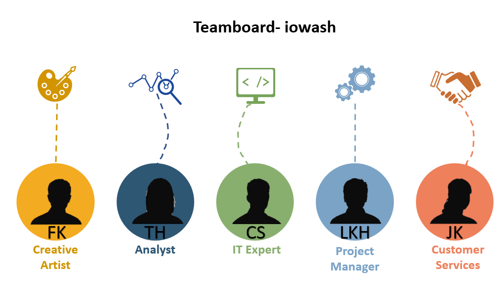

# 01 Co - Creation
Analyze IoT applications in context. Make your application understandable. Use instruments from other lectures, e. g. canvas methods.)

### Team Roles and Responsibilities
For a project to be successful, the project staff must work well together. For this it is necessary to optimally fill the project team.
Our team consists of 5 people, who are task-oriented and should work together.
In the first step, we defined which roles we need for the project. In the second step we decided which person in the team takes over which role.

The roles are as follows:

<b>Project Manager</b>  
operational organizational management of the project, implementation of project planning, project management, project controlling / status check, ensuring compliance with deadline and economic project goals

<b>Customer Services</b>  
Communication with the customer, definition of the requirements and contents of the project from the customer's point of view, carrying out tests and testing of all active systems and components, identifying the right channels for communication with customers (via web, social media, etc.)

<b>	Analyst</b> 
Identify state, describe existing problems / opportunities, define goals, create solution design / service design, create business case, analyze and optimize business processes

<b>IT Expert</b> 
examination of technical requirements, technical implementation of the project, creation of mockups, information on the status, on-time and cost-effective delivery of the results

<b>Creative Artist</b> 
development of marketing strategies, control of marketing activities (online and offline), campaign management, development of marketing concepts for existing or new products, production of product and image films

### List of used methods

### Personas and Value Proposition

In order to work out the goals and needs of our target group, we create potential users as personas. The goal is to develop a user-friendly product. Our personas are fictional users within our target group. Like real users, our personas have needs, abilities and goals. They do not represent the average of the crowd, but are specific people who make patterns in user behavior clear.

Our personas are <b>Rolf</b> (stressed system administrator with little time), <b>Anja</b> (student with first own apartment) and <b>Herbert</b> (property manager and responsible for the operation of washing machines).

#### Rolf

#### Anja

#### Herbert

### Lean canvas

### Wheels of Value

With the Wheels of Value it can be determined, that three groups benefit from the iowash concept: the manufacturing company, the property manager and the user of the washing machine.

The company sells the connected washing machine to the property manager and generates revenue from the sale of the machine. The facility manager places the device in a multiparty house and the residents are the users of this connected washing machine. Each washing process costs the user a certain amount of money, which is transferred to the property manager and a commission is returned to the company. The property manager has an interest in ensuring that the washing machine is used as often as possible to cover his costs. This is made possible by the app.

By calling up the application on his smartphone, the user can now see when the machine is free and book a time. This way he is assured that he will find a free washing machine at the booked date and that he will be spared unnecessary walks to the washroom. In addition, he will be informed before the end of the washing process that his clean laundry can be collected shortly. These functions avoid conflicts between residents regarding the usage of the facilities.

In addition, the facility manager can call up a dashboard provided by the company, which displays the most important key figures for the washing machines. The facility manager thus gains an overview of the machines and can also recognize on which weekdays or times of day the workload is low. In order to balance them, he can set favourable tariffs for appropriate periods. This in turn has the following effects: The flexible user can benefit from the favourable tariff and the user, who has to fall back on times in which the machine is frequently used, has a higher probability of being able to book it.
