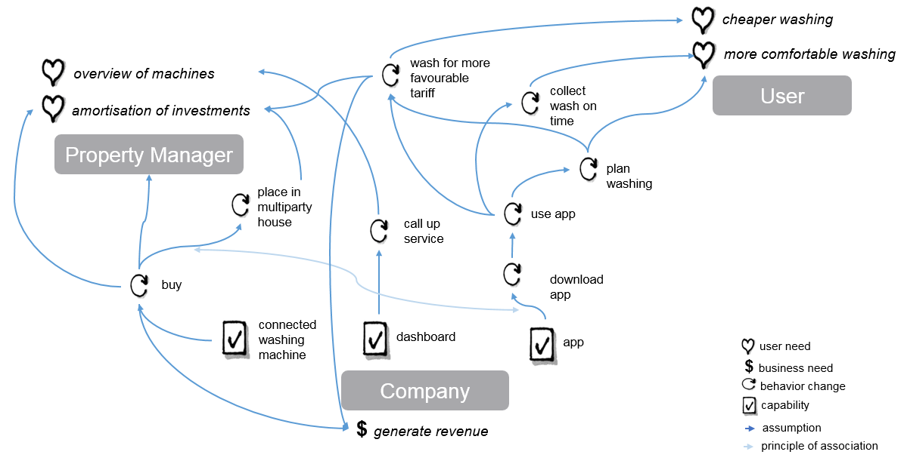

# 01 Co - Creation
Analyze IoT applications in context. Make your application understandable. Use instruments from other lectures, e. g. canvas methods.)

### List of used methods

### Wheels of Value

With the Wheels of Value it can be determined, that three groups benefit from the iowash concept: the manufacturing company, the property manager and the user of the washing machine.
The company sells the connected washing machine to the property manager and generates revenue from the sale of the machine. The facility manager places the device in a multiparty house and the residents are the users of this connected washing machine. Each washing process costs the user a certain amount of money, which is transferred to the property manager and a commission is returned to the company. The property manager has an interest in ensuring that the washing machine is used as often as possible to cover his costs. This is made possible by the app. By calling up the application on his smartphone, the user can now see when the machine is free and book a time. This way he is assured that he will find a free washing machine at the booked date and that he will be spared unnecessary walks to the washroom. In addition, he will be informed before the end of the washing process that his clean laundry can be collected shortly. These functions avoid conflicts between residents regarding the usage of the facilities. In addition, the facility manager can call up a dashboard provided by the company, which displays the most important key figures for the washing machines. The facility manager thus gains an overview of the machines and can also recognize on which weekdays or times of day the workload is low. In order to balance them, he can set favourable tariffs for appropriate periods. This in turn has the following effects: The flexible user can benefit from the favourable tariff and the user, who has to fall back on times in which the machine is frequently used, has a higher probability of being able to book it.
