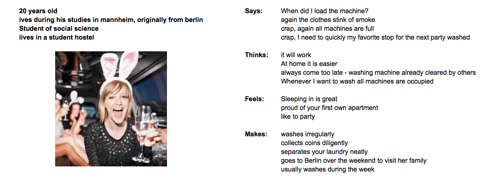
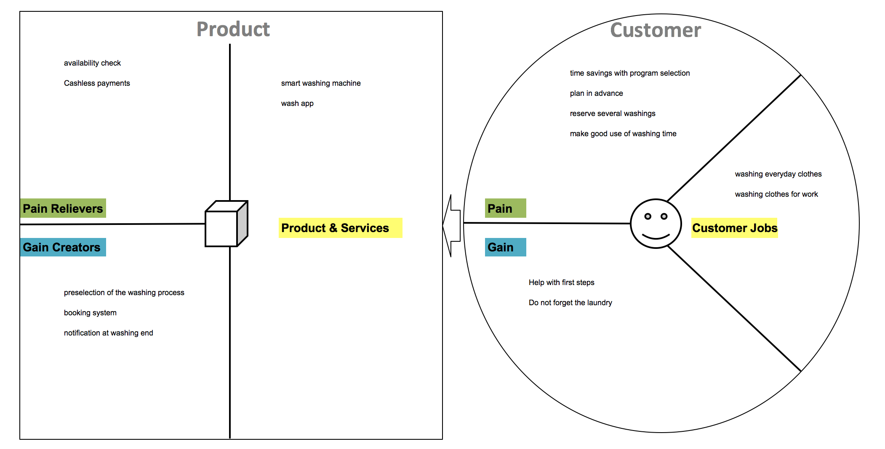
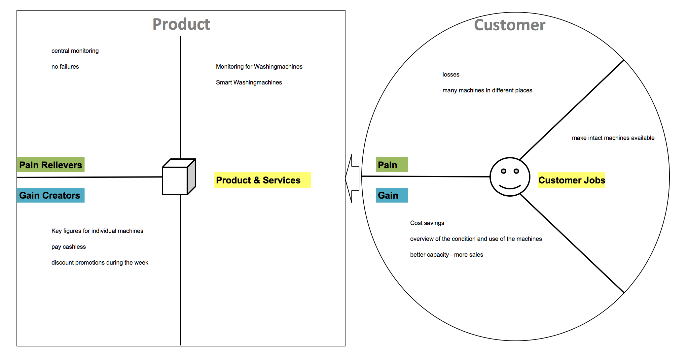
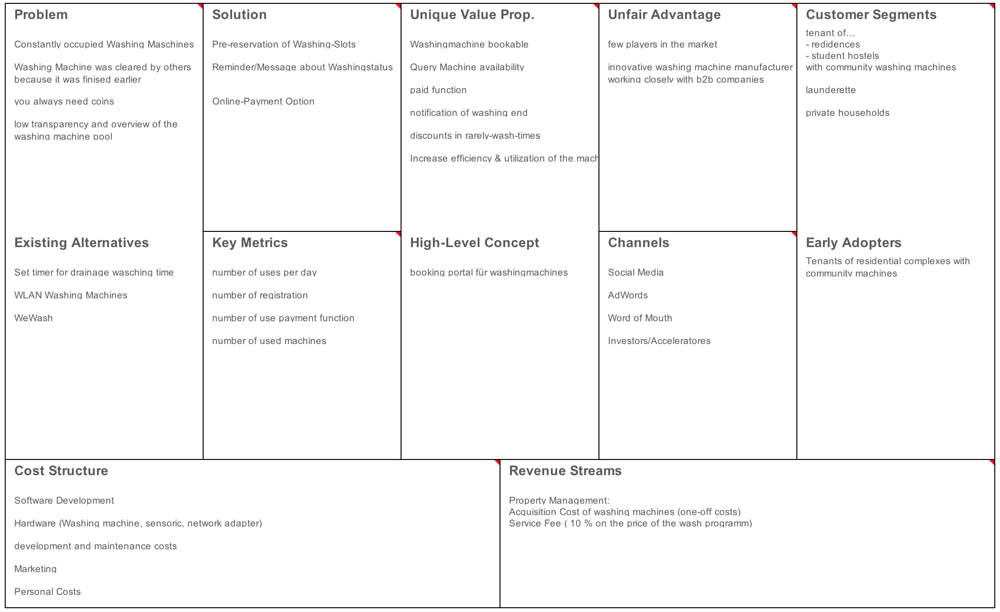

# 01 Co - Creation

#### [Team Roles and Responsibilities](https://github.com/hhzsmartlab/iowash/blob/master/01_Co-Creation/1.1_Team.md)

#### [List of used methods](https://github.com/hhzsmartlab/iowash/blob/master/01_Co-Creation/1.1_Methods.md)

### Personas

In order to work out the goals and needs of our target group, we create potential users as personas. The goal is to develop a user-friendly product. Our personas are fictional users within our target group. Like real users, our personas have needs, abilities and goals. They do not represent the average of the crowd, but are specific people who make patterns in user behavior clear.

First, we thought about which personas are needed. the group of users of communal washing machines is easy to isolate on residential complexes and student hostels.
For each of these two types of housing, we each created a persona as well as another persona for the administration of the washing machines.

Our personas are <b>Rolf</b> (stressed system administrator with little time, live in a residential complex), <b>Anja</b> (student with first own apartment, lives in a student hostel) and <b>Herbert</b> (property manager and responsible for the administration of washing machines).
The following describes the personas as such. It also describes what the appropriate persona says, thinks, feels and does about our problem.

#### Rolf

#### Anja

#### Herbert

### Value Proposition

#### Rolf

The stressed-out rolf works a lot during the week, as he has a great deal of responsibility in his job. Therefore, he only has to wash his laundry at the weekend. however, the washing machines are permanently occupied on the days. when he has finally found a free machine, the search starts for coins.  
In order to simplify the washing process, the product should offer an availability check in which the free machine can be pre-reserved. In addition, the possibility of cashless payment should be offered.

#### Anja

The student anja has lectures during the week in mannheim, but mostly confined to a few hours a day. every two weeks she travels home to berlin over the weekend. During the week she usually forgets to wash. And if she thinks about it on the weekend, the machines are mostly occupied. Unfortunately, she often forgets that she washes laundry. when she remembers, her freshly washed machine often lies on the floor and other laundry is in the machine. In addition, Anja usually has no money to wash as a student. 
For anja, the product should have an availability check if a machine is currently free. If she has any laundry then the application should inform her about the end, so that Anja can get the laundry out of the machine without having to pick it up from the floor. To give it a boost during the week, when hardly anyone washes to wash, the product could offer discounted washing times.

#### Herbert

Herbert is the property manager responsible for the administration of the washing machines. He constantly gets complaints that the washing machines are permanently occupied. The tenants would like to have more. But Herbert sees rarely used washing machines during the week and does not understand the problem. He manages many machines in different places and has to keep track of them. To get information about the current state of the washing machines, he has to drive himself into the residential complexes.  
A product for herbert would have to display all washing machines with their current status, which he manages. For him, an evaluation function of the machines would be optimal. With this he can see which machine, when and how busy. through offers in the empty periods he can give the residents an incentive to wash at this time. if the machines then accept cashless payment, he does not have to regularly empty the money boxes and do not worry about them being stolen.

### Lean canvas

### Wheels of Value

With the Wheels of Value it can be determined, that three groups benefit from the iowash concept: the manufacturing company, the property manager and the user of the washing machine.

The company sells the connected washing machine to the property manager and generates revenue from the sale of the machine. The facility manager places the device in a multiparty house and the residents are the users of this connected washing machine. Each washing process costs the user a certain amount of money, which is transferred to the property manager and a commission is returned to the company. The property manager has an interest in ensuring that the washing machine is used as often as possible to cover his costs. This is made possible by the app.

By calling up the application on his smartphone, the user can now see when the machine is free and book a time. This way he is assured that he will find a free washing machine at the booked date and that he will be spared unnecessary walks to the washroom. In addition, he will be informed before the end of the washing process that his clean laundry can be collected shortly. These functions avoid conflicts between residents regarding the usage of the facilities.

In addition, the facility manager can call up a dashboard provided by the company, which displays the most important key figures for the washing machines. The facility manager thus gains an overview of the machines and can also recognize on which weekdays or times of day the workload is low. In order to balance them, he can set favourable tariffs for appropriate periods. This in turn has the following effects: The flexible user can benefit from the favourable tariff and the user, who has to fall back on times in which the machine is frequently used, has a higher probability of being able to book it.
