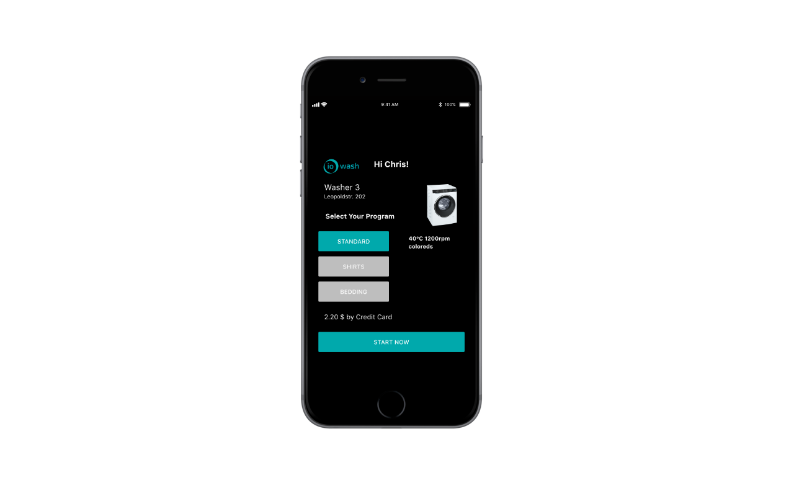

# 2. Exploration
## 2.2 Mock-Up

The interface of the washing machine is a touch screen that allows users to select a washing program and change settings like temperature and spin cycle. A timer indicates how long the washing machine will take to complete all stages of the washing program. Such control panels are already implemented for new generations of washing machines. The only additional element on the screen is a QR code that uniquely identifies the washing machine and leads users to the ioWash app. Also the current state of the settings can be updated remotely based on the selection of the users on their smartphone. For the mock up we do actually integrate with the washing machines touch screen but place a tablet showing that user interface on top of it.

The mock up of the smartphone app that is opened after scanning the QR skips the login procedure and simulates a single user account. So the same greeting and location of the washing machine is displayed for all testers. In the app three programs are suggested based on common usage behavior. Choosing of of these automatically updates the settings of the washing machine accordingly. Showing the price indicates the payment is processed by the app, even though that feature is not implemented for the mock up. The washing process can easily be started by clicking the "START NOW" button.

After starting the washing machine the user is forwarded to a new page with a timer. A gauge chart indicates how many minutes are left until completion. For the mock up the timer counts down in a fast mode. So it takes only a couple of seconds until a push notification pops up saying that the laundry can be picked up. That way the complete workflow can be simulated without waiting for more than one hour.

[:arrow_backward: ](../02_Exploration/2.1_System%20Architecture.md)[:arrow_up_small: ](../README.md)[:arrow_forward: ](../03_Experimentation/3_Experimentation.md)
