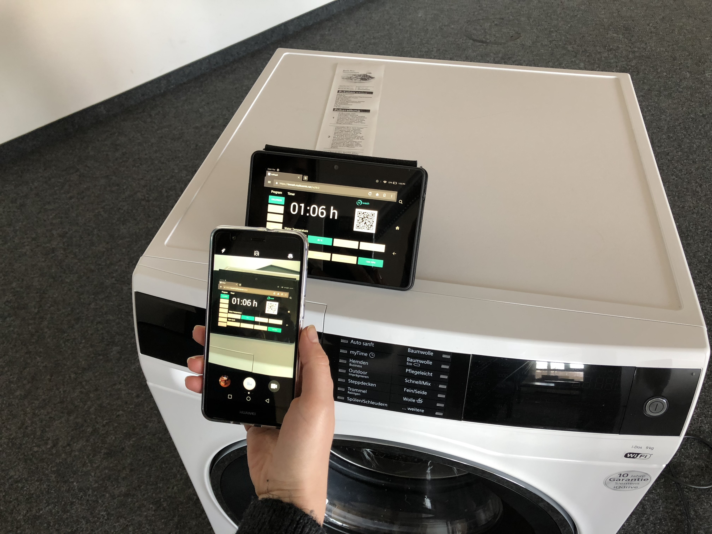
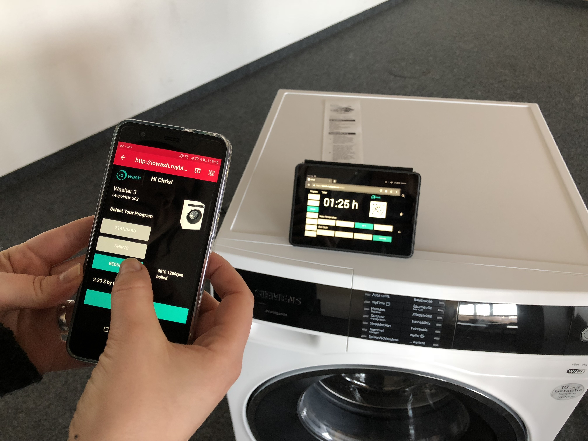
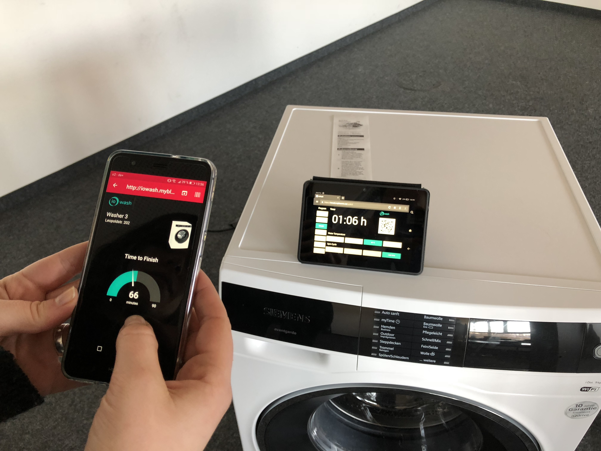

# 3. Experimentation
## 3.1 Living Lab Setup

The iowash `Living Lab Setup` describes the activities performed at the HHZ in Böblingen during the IoT-hackathon.

The web-enabled washing machine is extended by a dynamic display. Scanning the QR-code with own device enables a connection with the washing machine.

The washing program can be choosen directly on the displayed web interface.

When starting the wahsing program a countown is displayed in both - the device and the washing machine display.

## 3.2 Test Phase
Number of probands: **8**

### Methodical Procedure:
1) Explain baseline situation to probands in first iteration:

1 a) *"Imagine your are a student in student housing with community washing machines. You now want to wash your clothes. Please try using iowash to wash your clothes."*

1 b) Explain baseline situation to probands in second iteration:
*"Imagine your are a student in student housing with community washing machines. You now want to wash your **shirts**. Please try using iowash to wash them."*

2) Let the probands try to choose their washing program and start the washing procedure. At the same time, the test persons are observed and the interaction is documented in the Observation Sheet. 

3) After the test, the probands give their feedback in the Google Form.  

## 3.3 Data Collection

### Observation of probands:

**Demographics:**

Gender, Age, Job or Study Program

**Phase 1:**

How did the user approach the washing machine?
How did the user interact with the touch screen?
How did the user deal with the QR code?

**Phase 2:**

How did the user choose the washing program/change the settings/start it?
How long did the process from opening the app to starting the washing machine take?
Which features did the user explore?

**Phase 3:**

Did the user observe the timer?
How did the user react on the notification?

### Claim feedback in Google Form

1) How did you like the iowash service?
2) Which features did you find most useful?
3) What additional features would you expect?
4) Which features did you struggle with?
5) How could the service be easier to use?

[:arrow_backward: ](../02_Exploration/2.2_Mock-Up.md)[:arrow_up_small: ](../README.md)[:arrow_forward: ](../04_Evaluation/4_Evaluation.md)
