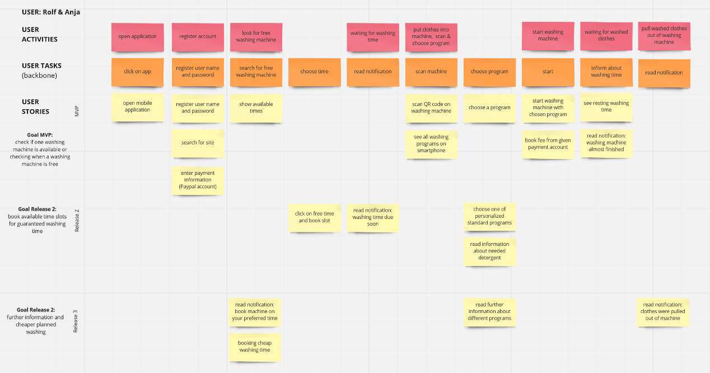

# 03 Experimentation
As a result of exploration, determine and justify an MVP of your application. Describe the Living Lab Setup, the users and which data should be collected for the evaluation. A concrete implementation is not necessary.

## Identifying the MVP

The two residents of the multi-party house Rolf and Anja open the application for the first time to see when a washing machine is available. The first time they open it, the two of them have to register for the service. Firstly, create an account, in which they specify the residential complex in which they live and enter their payment information for the Internet payment service.
After the initial registration, the utilization of the washing machines can be seen. When opening the app for the second time, the utilization is displayed immediately.

The Minimal Viable Product initially indicates when washing machines are occupied or free, so that the resident does not have to go to the washroom if all washing machines are already in use. Anja and Rolf see that there are still enough washing machines available. So they go to the washroom and fill a free machine with their clothes. In the next step they scan the QR code, which is attached to the device and all washing programs are displayed. The resident selects one and starts the washing process by app. At the same time, the laundry charge is transferred from the user's account to the property manager. Users can now see how long the washing process they have initiated is expected to take - the time is updated as soon as the washing machine's sensors detect adapted times. Five minutes before the washing process is completed, Rolf and Anja will be informed via push notification that they can pick up their laundry shortly. So they go to the laundry room and get their clean clothes out of the machines.

The second release makes it possible for the user - especially relevant for Rolf - to not only be able to see whether machines are free, but also to book additional periods for washing, in order to be guaranteed to find a free washing machine at the desired time. If Rolf has booked a period of time, he will be notified in advance so that he does not forget to bring his laundry to the washroom in time. After scanning the machine, Rolf also sees his two standard programs on the smartphone and does not need to get an overview of the many wash programs. These additional functions make washing much more comfortable for Rolf.
In the third release, the user - Rolf or Anja - receives proactive notifications to reserve preferred periods for washing and - especially relevant for Anja - to book more convenient times for washing. Anja can thus benefit from the fact that fewer residents use washing machines during the day, which is the reason why the property manager offers these times at a lower price.
