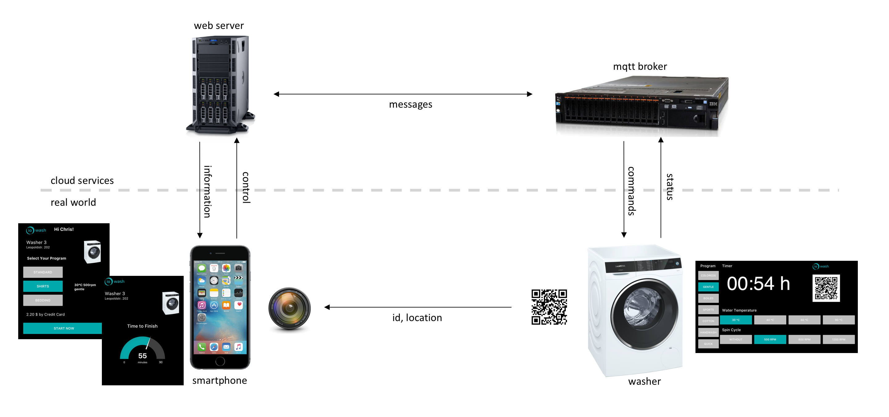
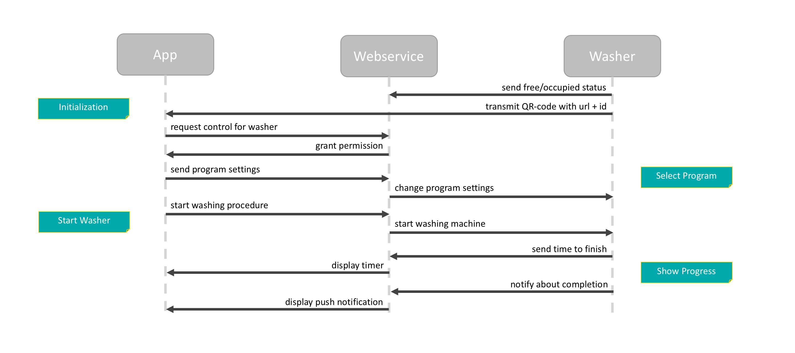
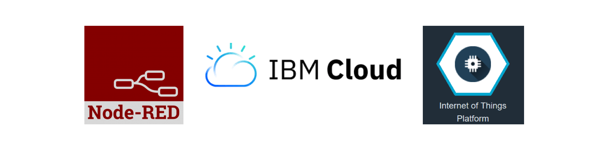

# iowash

## System Architecture and IoT Technologies
To evaluate the idea of ioWash in the context of a Living Lab Process a system was built using mock-up technologies. For production readiness an app on a smartphone and a dynamic display on an web-enabled washing machine would be required. As a simplification all features are implemented in a single web app. That way users are able to test the product on their smartphone and on a tablet on top of a washing machine. All interactions with the mock-up system are analogous to a real implementation, so that it is possible to explore application concepts and user behavior.



Scanning an QR code with their smartphone users can identify the washing machine. In the test setup an url is transmitted that opens a web app in a browser. Information about the user and the selected washing machine are requested from a web server. Depending on the current status (in use or available) further actions can be executed. For example a washing program based on common usage patterns can be selected. The settings are automatically send to the washing machine and displayed accordingly. It is also possible to start the washing procedure directly from the web app. After that the remaining time to finish will be displayed and updated steadily. At the end a push notification is sent to the user as a reminder to pick up the clothes.



The mock ups are implemented with cloud technologies from IBM. User interface and control flow are realized with Node-RED, which is a technology based on Node.js for rapid prototyping in the Internet of Things. The communication between UI elements and backend services is established via web sockets to exchange information dynamically. To send data from and to the washing machine the Internet of Things Platform is used as a message broker. It implements the lightweight protocol MQTT, which has built-in mechanism for a reliable message transport.



The messages between washing machine and backend services are exchanged based on conventions of the IoT Platform. The washing machine is registered with a unique `deviceId` and a `deviceType` for identification and addressability. Status reports from the washing machine are sent as `events` whereas instructions to the washing machine are sent as `commands`. The messages contain all relevant information and are structured in `json` format. The following code shows examples of topic strings and message payloads to receive settings and send remaining time:

```javascript
// Example: Message to Send Program Settings to Washer
var topic = "iot-2/type/washer/id/washer-leo-03/cmd/settings/fmt/json"
var payload = {
  program: "coloreds",
  spin: 1200
  temp: 40
}

// Example: Message to Send Remaining Time to App
var topic = "iot-2/type/washer/id/washer-leo-03/evt/time/fmt/json"
var payload = {
  timeToFinish: 33,
  timeTotal: 66,
  timePercentage: 50
}
```
