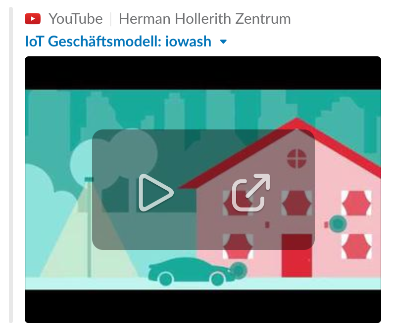

# iowash
### Herman Hollerith Research Center  
#### MSc. Digital Business Management (DBM16)
Group assignment as part of the module `Internet of Things` by [@cdeck3r](https://github.com/cdeck3r)  

Authors: [@JasminKircher](https://github.com/JasminKircher) [@T9876](https://github.com/T9876) [@ChrisSen](https://github.com/ChrisSen) [@klonsian](https://github.com/klonsian) [@lekuhe](https://github.com/lekuhe)

### The IoT Service for Community Washing Machines

The Internet of things (IoT) describes embedded devices with Internet connectivity, allowing them to interact with each other, services, and people on a global scale. Basically, all technologies and solutions that enable the integration of real world data and services into the current information networking technologies are described as IoT. By 2020, the number of networked devices is expected to rise to 20,000,000,000,000. This is 500,000 times the earth’s equator. The revenue made with IoT will rise up to 50 billion Euros by 2020...

## Way of proceeding
### 1. Co - Creation

`To start with we analyze the #iowash application in context. We then make the application understandable by using instruments from other lectures (e. g. canvas methods).`

#### [1.1 Team Roles and Responsibilities](https://github.com/hhzsmartlab/iowash/blob/master/01_Co-Creation/1.1_Team.md)

#### [1.2 List of used methods](https://github.com/hhzsmartlab/iowash/blob/master/01_Co-Creation/1.2_Methods.md)

##### [1.2.1 Personas](../master/01_Co-Creation/1.2_Methods.md#personas)
##### [1.2.2 Value Proposition](../master/01_Co-Creation/1.2_Methods.md#value-proposition)
##### [1.2.3 Lean canvas](../master/01_Co-Creation/1.2_Methods.md#lean-canvas)
##### [1.2.4 Wheels of Value](../master/01_Co-Creation/1.2_Methods.md#wheels-of-value)
##### [1.2.5 Service Blueprint](../master/01_Co-Creation/1.2_Methods.md#service-blueprint)
##### [1.2.6 Identifying the MVP](../master/01_Co-Creation/1.2_Methods.md#identifying-the-mvp)

### 2. Exploration
`In a test setup we show how our idea can work. We use IoT Mock-up technology, which we expect to be generally available.`

#### [2.1 System Architecture](../master/02_Exploration/2.1_System%20Architecture.md)
#### [2.2 Mock-Up](../master/02_Exploration/2.2_Mock-Up.md)

### 3. Experimentation
`As a result of the exploration phase, we determine and justify an MVP of our application. Furthermore we describe the Living Lab Setup, the users and which data should be collected for the evaluation.`

#### [3.1 Living Lab Setup](../master/03_Experimentation/3.1_Living-Lab-Setup.md#31-living-lab-setup)
#### [3.2 Test Phase](../master/03_Experimentation/3.1_Living-Lab-Setup.md#32-test-phase)
#### [3.3 Data Collection](../master/03_Experimentation/3.1_Living-Lab-Setup.md#33-data-collection)

### 4. Evaluation
`Finally, we describe possible results from the experimental phase and how we can recognize them in the data.`

#### [4.1 Validation](../master/04_Evaluation/4_Evaluation.md#41-validation)
#### [4.2 Data Analysis](../master/04_Evaluation/4_Evaluation.md#42-data-analysis)
#### [4.3 Conclusions](../master/04_Evaluation/4_Evaluation.md#43-conclusions)
