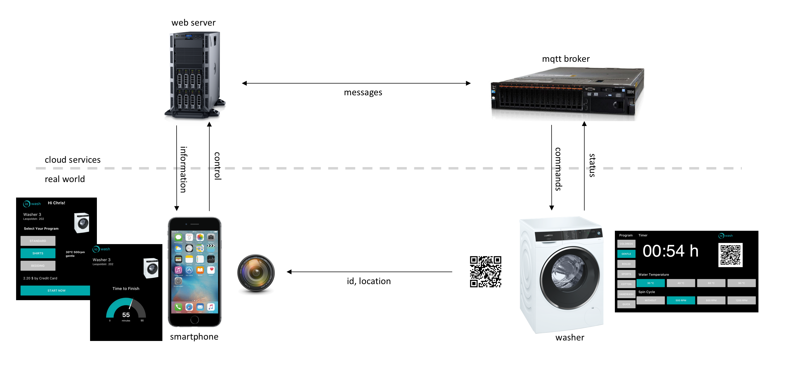

# iowash

## IoT-Technologien und Systemarchitektur
Um die Idee von ioWash im Rahmen des Living Lab Prozesses zu untersuchen, wurde das System mithilfe einer Mock-Up Technologie aufgebaut. Für den produktiven Einsatz müsste eine App auf dem Smartphone sowie eine dynamische Anzeige auf einer internetfähigen Waschmaschine vorhanden sein. Als Vereinfachung wurden die Funktionsabläufe in einer Web-App implementiert, die alle Features des MVP unterstützt und auf dem Smartphone des Benutzers sowie einem Tablet an der Waschmaschine genutzt werden kann. Alle Interaktionen mit dem Mock-Up System sind bei diesem Aufbau vergleichbar mit einer realen Implementierung, sodass die Konzepte und das Nutzerverhalten damit evaluiert werden können.



Durch das Scannen eines QR-Code kann der Benutzer mit seinem Smartphone die Waschmaschine eindeutig identifizieren. Im Testaufbau wird die URL zu einer Web-App übertragen, die sich im Browser öffnet. Von einem Webserver werden Informationen über den Benutzer und die gewählte Waschmaschine abgerufen. Abhängig vom aktuellen Belegungsstatus können weiterführende Aktionen wie das Auswählen eines Waschprogramms ausgelöst werden. Die Einstellungen werden unmittelbar an die Waschmaschine übertragen und auf der Anzeige reflektiert. Auch das Starten des Waschvorgangs ist direkt aus der Web-App heraus möglich. Danach wird dem Benutzer die verbleibende Zeit angezeigt und regelmäßig aktualisiert. Durch eine Push-Benachrichtigung wird der Benutzer auf das Ende des Programms hingewiesen.


Für die Implementierung des Mock-Ups wurde auf Cloudtechnologien von IBM zurück gegriffen. Die Benutzeroberfläche und die Ablaufsteuerung wurden mit Node-RED realisiert. Dabei handelt es sich um ein auf Node.js basierendes Tool zur schnellen Entwicklung von Prototypen im Internet of Things. Die Kommunikation zwischen den UI-Elementen und Backend-Services läuft über Websockets für einen dynamischen Informationsaustausch ab. Für die Übertragung von Daten von und zur Waschmaschine wurde das MQTT eingesetzt. Es handelt sich dabei um ein leichtgewichtiges Protokoll mit eingebauten Mechanismen für einen zuverlässigen Transport bei instabilen Netzwerkverbindungen. Als Message-Broker zum Nachrichtenaustausch wurde die Internet of Things Platform verwendet.


Bei dem Nachrichtenaustausch zwischen Waschmaschine und Backend-Services wurde sich an die Konventionen der IoT Platform gehalten. Die Waschmaschine wurde registriert mit einer `deviceId` und einem `deviceType`, um sie eindeutig identifizieren und ansprechen zu können. Statusmeldungen von der Waschmaschine wurden als `events` gesendet, wohingegen Befehle an die Waschmaschine als `commands` geschickt wurden. Als Format der Nachrichten wurde `json` verwendet, um die jeweils relevanten Informationen zu übergeben. Daraus ergibt sich die typische Struktur für die Topic-Strings und den Aufbau des Payloads, wie folgende Beispiele zum Empfangen der Einstellung und Senden der verbleibenden Zeit zeigen:

```javascript
// Example: Message to Send Program Settings to Washer
var topic = "iot-2/type/washer/id/washer-leo-03/cmd/settings/fmt/json"
var payload = {
  program: "coloreds",
  spin: 1200
  temp: 40
}

// Example: Message to Send Remaining Time to App
var topic = "iot-2/type/washer/id/washer-leo-03/evt/time/fmt/json"
var payload = {
  timeToFinish: 33,
  timeTotal: 66,
  timePercentage: 50
}
```
